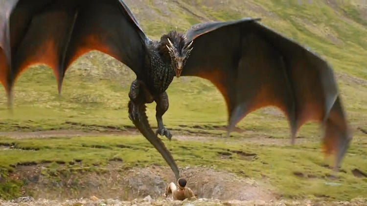

### GitHub Username: yeshuaggarwal
### Student Name: Yeshu Aggarwal
### Student ID: 20103933

## Project Info

**GitHub Link:** https://github.com/yeshuaggarwal/A7_Aggarwal_Yeshu.git

### Load libraries
```{r}
library(ape)
library(reshape2)
library(ggplot2)
library(ggtree)
```

### Import Data
```{r}
DragonNexus<-read.nexus.data("C:/Users/yeshu/Desktop/A7_Aggarwal_Yeshu/input/DragonMatrix.nex")
head(DragonNexus)
```

```{r}
names(DragonNexus)
```

### Convert the data into Distance Matrix
```{r}
DragonNexusDF<-data.frame(matrix(unlist(DragonNexus), ncol = 78, byrow = T))
row.names(DragonNexusDF)<-names(DragonNexus)
head(DragonNexusDF)
```

```{r}
DragonDist<-dist(DragonNexusDF,method='binary')
```
```{r}
DragonDistMat<-as.matrix(DragonDist)
```

### Visualize the Distance Matrix Data
```{r}
PDat<-melt(DragonDistMat)
```

```{r}
dim(DragonDistMat)
```

```{r}
head(DragonDistMat)
```

```{r}
dim(PDat)
```

```{r}
head(PDat)
```

```{r}
ggplot(data=PDat, aes(x=Var1, y=Var2, fill=value)) +
  geom_tile()+scale_fill_gradientn(colours=c("white","blue","green","red")) + theme(axis.text.x = element_text(angle = 90, hjust = 1, vjust = 0.5))
```
Figure 1: The figure shows the range of values clustered together by distance.

### Apply trait weightings to the data
```{r}
WeightsDat<-read.csv("C:/Users/yeshu/Desktop/A7_Aggarwal_Yeshu/Weights.csv")
Weights<-paste0(WeightsDat$Weight,collapse = "")
Weights<-strsplit(Weights,split="")[[1]]
```

```{r}
LETTERS
```

```{r}
which(LETTERS=="G")
```

```{r}
WeightsNum<-rep(NA,length(Weights))
for(i in 1:length(WeightsNum)){
  if(Weights[i] %in% LETTERS){
    WeightsNum[i]<-which(LETTERS==Weights[i])+9
  } else {
    WeightsNum[i]<-Weights[i]
  }
}
WeightsNum<-as.numeric(WeightsNum)
```

```{r}
length(WeightsNum)
```

### Multiply weight value by the trait vector for each dragon.
```{r}
WtDragonNexus<-DragonNexus

for (i in 1:length(DragonNexus)){
  RepWeight<-DragonNexus[[i]]==1
  WtDragonNexus[[i]][RepWeight]<-WeightsNum[RepWeight]
  RepWeight<-NA
}
```

### Re-calculated Distance Matrix
```{r}
WtDragonNexusDF<-data.frame(matrix(unlist(WtDragonNexus),ncol=78,byrow=T))
row.names(WtDragonNexusDF)<-names(WtDragonNexus)
WtDragonDist<-dist(WtDragonNexusDF,method='euclidean')
```

```{r}
WtDragonDistMat<-as.matrix(WtDragonDist)
```


```{r}
WtPDat<-melt(WtDragonDistMat)
ggplot(data = WtPDat, aes(x=Var1, y=Var2, fill=value)) + 
  geom_tile()+scale_fill_gradientn(colours=c("white","blue","green","red")) +
  theme(axis.text.x = element_text(angle = 90, hjust = 1, vjust = 0.5))
```
Figure 2: This figure is the re-calculated distance matrix with weightings. It shows to have a stronger clusters of values.

### Plot Tree and Tree Formatting

```{r}
WtDragonTreeME<-fastme.bal(WtDragonDist)
ggtree(WtDragonTreeME,layout="circular")
```

```{r}
str(WtDragonTreeME)
```
```{r}
head(WtDragonTreeME$tip.label)
```

```{r}
Names<-gsub("[0-9\\.]+([^X]+)X*","\\1", WtDragonTreeME$tip.label)
```

```{r}
Group<-split(WtDragonTreeME$tip.label, Names)
```

```{r}
WtDTcol<-groupOTU(WtDragonTreeME,Group)
str(WtDTcol)
```

```{r}
ggtree(WtDTcol, branch.length="none", layout = "circular", aes(colour=group)) + geom_tiplab(size=2, aes(angle=angle)) + geom_point(aes(shape = isTip, color = isTip), size = 2) + geom_hilight(node=97, fill="gold") + labs(caption = "Dragon Phylogeny")
```
### Import Dragon Pictures

#Dragon 01

[] (https://www.pngitem.com/middle/iRJxxx_sofia-the-first-characters-png-transparent-png/)

Citation: https://www.pngitem.com/middle/iRJxxx_sofia-the-first-characters-png-transparent-png/

#Dragon 02

[] (https://www.gq-magazine.co.uk/article/game-of-thrones-dragons-growing-up-in-public)

Citation: https://www.gq-magazine.co.uk/article/game-of-thrones-dragons-growing-up-in-public

#Dragon 03

[] (https://monster.fandom.com/wiki/Dragon)

Citation: https://monster.fandom.com/wiki/Dragon


